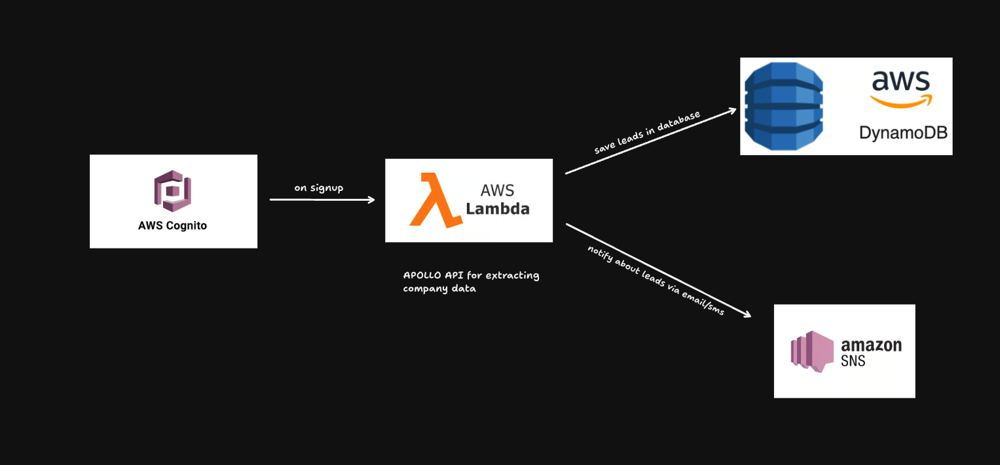

# 📍 LeadAgent

**LeadAgent** is a serverless lead qualification tool built on AWS. It automatically enriches and stores company data when a user signs up and sends you an instant email if the user works in a target industry (e.g. video editing). The goal: identify high-value business leads at signup with zero manual effort.

---

## How It Works



1. **User signs up** via AWS Cognito.
2. A **Lambda function** is triggered upon account confirmation (`PostConfirmation_ConfirmSignUp` event).
3. The Lambda function:
   - Extracts the user's email domain.
   - Skips common personal domains like Gmail, Yahoo, etc.
   - Calls the Apollo API to retrieve company information based on the domain.
   - Validates if the company matches pre-configured keywords (e.g., "video editing").
   - If relevant, stores the data in **DynamoDB** and sends an alert via **SNS email**.

---

## 🛠 Technologies Used

| Component      | Service                                |
| -------------- | -------------------------------------- |
| Auth & Trigger | AWS Cognito (PostConfirmation trigger) |
| Runtime        | AWS Lambda (Node.js)                   |
| Data Store     | AWS DynamoDB                           |
| Alerts         | AWS SNS (Simple Notification Service)  |
| Enrichment API | Apollo.io                              |

---

## Setup Instructions

### 1. **Environment Variables**

Configure the following environment variables in your Lambda function:

- `APOLLO_API_KEY`: Your Apollo.io API key
- `SNS_TOPIC_ARN`: Your SNS topic ARN
- `DYNAMO_TABLE_NAME`: DynamoDB table name (defaults to "EnterpriseSalesLead")

### 2. **AWS Infrastructure Setup**

1. **Create a DynamoDB table**:

   - Table name: `EnterpriseSalesLead` (or your custom name)
   - Partition key: `ID` (String)

2. **Create an SNS topic**:

   - Add email subscription for lead notifications
   - Note the topic ARN for the environment variable

3. **Deploy the Lambda function**:

   - Upload `aws/enterpriseLeadNotification.js`
   - Set the environment variables listed above
   - Ensure the function has proper IAM permissions (see below)

4. **Configure Cognito trigger**:
   - Attach the Lambda function to the **PostConfirmation_ConfirmSignUp** trigger

### 3. **IAM Permissions**

Your Lambda function needs these IAM permissions:

```json
{
  "Version": "2012-10-17",
  "Statement": [
    {
      "Effect": "Allow",
      "Action": [
        "dynamodb:PutItem"
      ],
      "Resource": "arn:aws:dynamodb:*:*:table/EnterpriseSalesLead"
    },
    {
      "Effect": "Allow",
      "Action": [
        "sns:Publish"
      ],
      "Resource": "arn:aws:sns:*:*:EnterpriseSalesLeadEmail"
    },
    {
      "Effect": "Allow",
      "Action": [
        "logs:CreateLogGroup",
        "logs:CreateLogStream",
        "logs:PutLogEvents"
      ],
      "Resource": "*"
    }
  ]
}
```

### 4. **Frontend Development (Optional)**

If you want to run the React frontend locally:

```bash
# Install dependencies
npm install
# or
yarn install

# Start development server
npm run dev
# or
yarn dev
```

---

## License

This project is built for hackathon demonstration purposes and is not intended for production use without further security and performance considerations.
